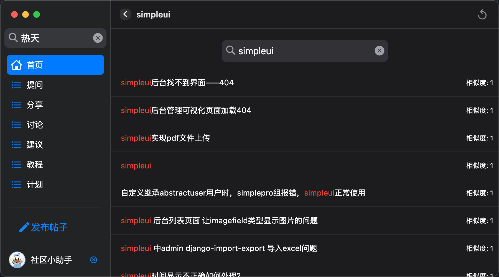

# simple_shark

采用`flutter`开发的一个桌面版社区客户端.

可以支持以下平台：
+ macOS
+ Windows
+ Linux
+ Web

> 当然 iOS和Android也是可以支持的，只不过没有对其进行适配。

## 在线体验

[https://shark.72wo.com/](https://shark.72wo.com/)

## 预览图





## 下载地址
[https://github.com/newpanjing/simple_shark/releases/](https://github.com/newpanjing/simple_shark/releases/)

## 运行指南

+ 安装依赖包
```shell
flutter pub get
```

+ 直接运行：
```shell
flutter run --no-sound-null-safety
```

+ 构建Release

```shell
# 创建一个macOS的Release版本
flutter run -d macos --no-sound-null-safety

# 创建一个Windows的Release版本
flutter run -d windows --no-sound-null-safety

# 创建一个linux的Release版本
flutter run -d linux --no-sound-null-safety

# 创建一个Web的Release版本
flutter run -d web --no-sound-null-safety
```